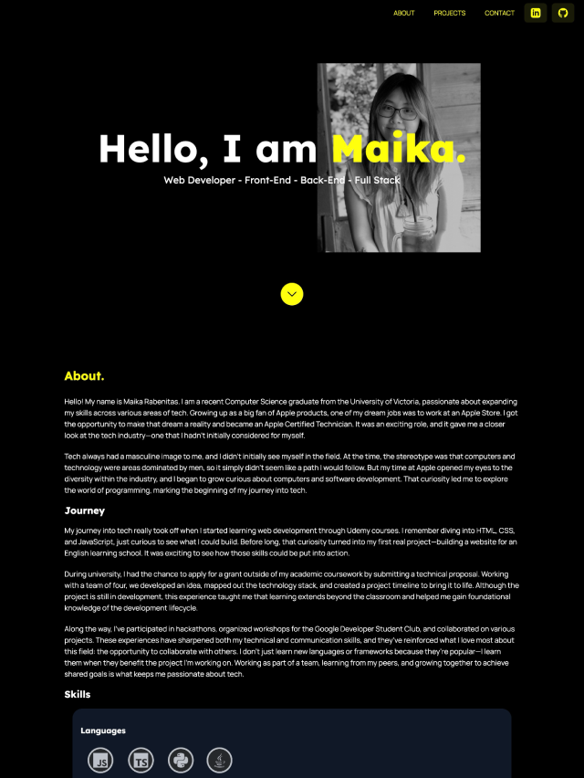

# Portfolio Website

A personal portfolio website to showcase my skills and projects.

## Description
This portfolio highlights my work as a web developer, featuring projects in front-end, back-end, and full-stack development. It is designed to be simple, fast, and responsive, making it easy for potential employers to view my experience and projects.

## Usage
Visit the website at https://maikacoleen.netlify.app/


## Features
- Responsive design
- Smooth animations on hover

## Technologies
- Astro: Static site generator for building fast, modern websites
- React: Front-end library for interactive components
- Tailwind CSS: Utility-first CSS framework for rapid styling
- JavaScript: Dynamic behavior on hover and animations

## Installation

1. Clone the repo:
   ```bash
   git clone https://github.com/maikacoleen/myprofile.git